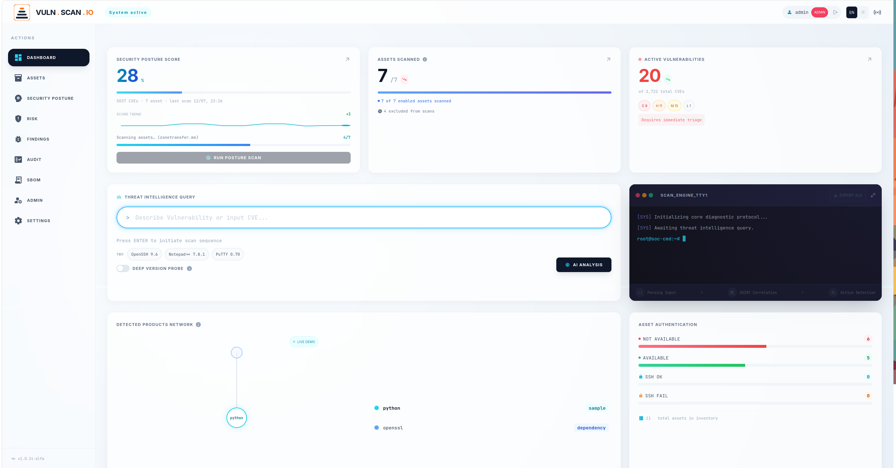
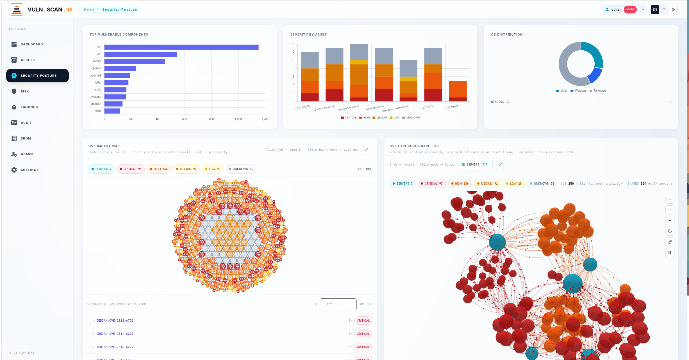
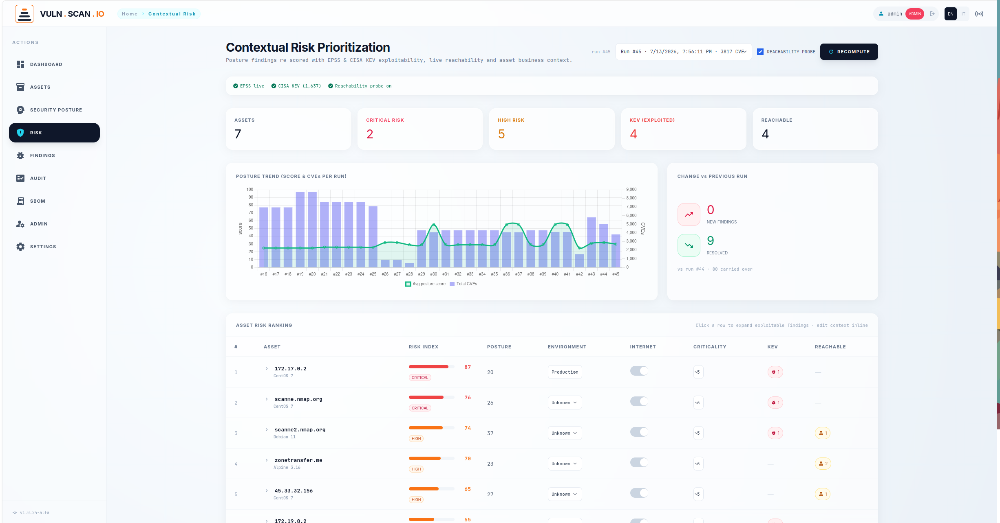

# Vulnerability Feed Aggregator

<p align="center">
  
</p>

Web app for **authorized audits**: manages an asset inventory, identifies vulnerable software from a **free-text description** (even without an explicit CVE), runs network scans, enriches results with CVE data, and produces AI-driven security posture analysis.

Backend **FastAPI** · Frontend **HTML + Tailwind** (CDN) · real-time results via **Server-Sent Events** · persistence on **local Supabase (Docker)**.


> ⚠️ **Responsible use.** Only run scans or logins against assets you own or are explicitly authorized to test. Scanning third-party systems without permission is illegal.





---

## Installation

Requires: **Python 3.10+**, `pip`, `venv`, `curl`, `git`, **Docker** (with the `docker compose` v2 plugin), **Go ≥ 1.21** (to build `encdec`).
On Debian/Ubuntu: `sudo apt install python3-pip python3-venv curl git golang docker-compose-plugin`

**Missing dependencies are installed automatically.** At every launch `start.sh` runs a preflight on `python3`/`venv`/`curl`/`git` and, before using them, checks Go (≥ 1.21), Docker (binary + running daemon) and the `docker compose` v2 plugin: anything missing is installed via `apt` (sudo prompt) — if `apt` is unavailable or the install fails, the script aborts with manual instructions.

> **Go tarball fallback.** If the package manager doesn't provide Go ≥ 1.21 (e.g. Debian 12), `start.sh` downloads the latest official release from `go.dev` and installs it to `/usr/local/go`. The script exports `PATH=/usr/local/go/bin:$PATH` **only for its own session**: to use that Go in your shell too, add the same line to `~/.bashrc` (prepend, not append, or a `go` from apt in `/usr/bin` will take precedence). Do **not** set `GOROOT` manually — each Go binary auto-detects its own. Not needed on Ubuntu 24.04, whose `golang` package (1.22) already satisfies the requirement. **Ollama and the default LLM** do not need to be pre-installed either. In the wizard, choosing the local provider asks **whether to install Ollama** (official `ollama.com` script) and **which model to use**: `qwen2.5:7b` (default), `llama3.1:8b`, `mistral:7b` or any custom name. The choice is saved in `config.json` (`ai.ollama_autoinstall`, `ai.ollama_model`). Then at **every launch**, if the provider is Ollama with a local URL, the script installs Ollama if missing (unless the user opted out in the wizard), starts the server if needed, pulls the configured model if absent and verifies via `/api/tags` that it is actually available.

### First run (interactive wizard)

```bash
git clone <repo>
cd vuln.scan.io
chmod +x start.sh stop.sh
./start.sh
```

As an alternative to `clone`, you can always download the artifact for a **tag/release** as a `.zip` package (repo *Tags* page → *Download ZIP*, or `<repo>/archive/refs/tags/<tag>.zip`): extract it and continue from `cd vuln.scan.io` onward.

To update an existing installation, see [Application updates](#application-updates) (`./start.sh update` → option 4).

---

## `start.sh` — startup and configuration

The script is the single entry point. It handles, in sequence: password encryption, AI/search configuration, Docker test machine, virtualenv, Supabase and the FastAPI server.

### Execution phases 

```
start.sh
 │
 ├─ 0) Preflight         ──► python3 / venv / curl / git: auto-install via apt if missing
 │
 ├─ 1) encdec setup      ──► first run: asks for a secret prefix → patches source → compiles binary (Go ≥ 1.21 verified)
 │                            later runs: binary already present, no interaction
 │
 ├─ 2) Wizard / Update
 │     ├─ AI provider    ──► Local Ollama  |  Claude API
 │     ├─ Search engine  ──► DuckDuckGo    |  Serper
 │     └─ Docker test    ──► creates a vulnerable Linux machine (optional)
 │
 ├─ 2b) AI precheck      ──► provider ollama: install ollama + pull default LLM (qwen2.5:7b) if missing
 ├─ 3) Virtualenv        ──► creates .venv, installs requirements.txt
 ├─ 4) Supabase          ──► starts Docker stack (skippable with --no-supabase)
 └─ 5) FastAPI           ──► exec uvicorn app:app --host 127.0.0.1 --port $PORT
```

### Startup modes

```bash
./start.sh                        # normal startup (port 8000)
PORT=9000 ./start.sh              # custom port
./start.sh --no-supabase          # skip Supabase
./start.sh update                 # config-edit menu
./start.sh update --no-supabase   # edit config without Supabase
```

### First-run wizard

On first run (no `config.json`) the wizard asks for:

1. **encdec secret prefix** — entered once; compiled into the binary (see the Password Encryption section)
2. **AI model**:
   - `Local` → Ollama: asks whether to install it if missing, model menu (`qwen2.5:7b` default, `llama3.1:8b`, `mistral:7b`, or custom), then starts the server, runs `ollama pull`, verifies the model via `/api/tags`
   - `Remote` → Claude API (requires API key)
3. **OSINT search engine**:
   - `DuckDuckGo` — free, no API key
   - `Serper` — Google results, requires API key
4. **Docker Linux test machine** — optional (see dedicated section)

### Application updates

The app checks GitHub for a newer tag than the local version (the one shown
bottom-left in the sidebar):

- **In the UI** — a discreet, dismissible banner appears at the bottom-left of
  every page when a newer tag exists on GitHub ("New version vX available —
  update with ./start.sh update"). The check runs server-side
  (`GET /api/version/check`) and is cached for 6 hours; dismissing the banner
  hides it until the *next* version. Repo overridable with the
  `VFA_GITHUB_REPO` env var.
- **From the CLI** — `./start.sh update` → "Controlla aggiornamenti
  applicazione (GitHub)": compares the local git tag with the latest GitHub
  tag and, on confirmation, downloads the sources:
  - with a `.git` checkout: `git fetch --tags` + `git checkout <tag>`
    (aborts if there are uncommitted local changes);
  - without git: downloads the release tarball and applies it with `rsync`,
    **preserving runtime files** (`config.json`, `.venv/`, `.encdec/`,
    `.vfa_auth_secret`, Supabase data, logs).

  Then relaunch with `./start.sh`: dependencies and DB schema are realigned
  automatically at startup.

#### How to update, step by step

```bash
# 1. Stop the app (FastAPI + Supabase stack)
./stop.sh

# 2. Open the update menu and pick option 4
./start.sh update
#    Cosa vuoi modificare?
#      ...
#      4) Controlla aggiornamenti applicazione (GitHub)
#    -> shows local vs latest version, asks "Scaricare e installare ora? [s]"

# 3. Relaunch: venv dependencies and the DB schema are realigned automatically
./start.sh
```

Notes:

- **What is never touched by an update**: `config.json` (wizard config and API
  keys), `.venv/`, the `encdec` binary with your compiled secret
  (`.encdec/`), the session-token secret (`.vfa_auth_secret`), the Supabase
  data volume (scan history, users, findings) and the log files.
- **Git checkout with local edits**: the updater refuses to run if
  `git diff` is dirty — commit or stash your changes first, then retry.
- **Rollback (git installs)**: every release is a tag, so
  `git checkout <previous-tag>` followed by `./start.sh` brings you back.
- Users are notified in the web UI too: a dismissible banner at the
  bottom-left appears on every page when a newer version exists.

### `update` menu

```bash
./start.sh update
```

Shows the current configuration and lets you:

| Option | Action |
|---|---|
| 1 | Change AI provider (Ollama ↔ Claude) |
| 2 | Change search engine (DuckDuckGo ↔ Serper) |
| 3 | Create/start Docker Linux test machine |
| 4 | Check for application updates on GitHub (and download them) |
| 5 | Save and exit (config only, doesn't launch the app) |
| 6 | Save and launch the app |

---

## `stop.sh` — full shutdown

```bash
./stop.sh
```

Runs in sequence:

1. **Shuts down the Supabase stack** (`docker compose down`) — data persists in `supabase/volumes/db/data`
2. **Removes the test container** `vuln-test-linux-1` if present (`docker rm -f`)

The FastAPI server stops separately with `Ctrl+C` in the terminal running `start.sh`.

---

## Asset password encryption (`encdec`)

Asset passwords are encrypted at rest via the [encdec](https://github.com/daniloritarossi/encdec) binary.

### How it works

| Phase | Detail |
|---|---|
| **First build** | `start.sh` asks for a secret prefix (with confirmation), patches `defaultSecretKeyPrefix` in `lib/lib.go` and builds the binary at `.encdec/encdec` |
| **Later runs** | Binary already present → no interaction, no password prompt |
| **Secret** | Compiled into the binary; never on disk or in environment variables |
| **Algorithm** | Machine-bound AES-GCM with an application prefix (`ENC`/`DEC`) |
| **Format in `assets` table** | `ENC:<hex-ciphertext>` |

### Encrypt/decrypt flow

```
UI enters password      →  POST /api/assets
                            └─ crypto.encrypt_password()
                               └─ encdec ENC <plain>  →  ENC:<hex>  →  Supabase table 'assets'

Asset SSH login         →  scanner._scan_auth_real()
                            └─ crypto.decrypt_password(ENC:<hex>)
                               └─ encdec DEC <hex>  →  plaintext password  →  paramiko
```

### `crypto.py` module

| Function | Behavior |
|---|---|
| `encrypt_password(plain)` | Calls `encdec ENC`, prefixes with `ENC:`, returns the encrypted string |
| `decrypt_password(stored)` | String without `ENC:` → returned unchanged (backward compat.); `ENC:` string → calls `encdec DEC` |
| `is_encrypted(val)` | `True` if the string starts with `ENC:` |

> If the password isn't encrypted (plaintext), the app flags it with an orange **NOT ENCRYPTED** badge on the Asset Inventory page and rejects SSH login during the health check.

---

## Test machines (Docker)

The wizard (first run or `./start.sh update` → option 3) asks **which** test machine to create:

```
Which test machine do you want to create?
  1) Linux   — Ubuntu 20.04 + SSH + Python 3.6 (outdated)
  2) Windows — Win 11 (KVM) + Notepad++ 7.8.1 + PuTTY 0.70 (vulnerable)
  3) None    — skip
```

Both use `admin` / `admin` credentials and, once setup finishes, offer the same "Add to asset inventory?" submenu (encrypted / plaintext / No). The asset is inserted into the Supabase `assets` table via PostgREST.

### Linux — specs

| Parameter | Value |
|---|---|
| Base image | `ubuntu:20.04` |
| Python | 3.6 (via the `deadsnakes` PPA — intentionally outdated version) |
| SSH | `openssh-server`, `PasswordAuthentication yes`, `PermitRootLogin no` |
| User | `admin` / password `admin` (in the `sudo` group) |
| Container name | `vuln-test-linux-1` |
| Network | Docker bridge (`172.17.0.x`) |

Idempotent build: on every run the wizard rewrites the `Dockerfile`, rebuilds the `vuln-test-linux` image, and removes/recreates the `vuln-test-linux-1` container.

### Lifecycle

```bash
# Creation (via wizard)
./start.sh update   # → option 3

# Verification
ssh admin@172.17.0.2       # password: admin
python3.6 --version         # Python 3.6.x (outdated, via deadsnakes)

# Stop and removal
./stop.sh                   # removes the container automatically
```

### "Add to asset inventory?" submenu

After the container starts, the wizard asks whether to add it to the inventory, with three choices:

| Option | Behavior |
|---|---|
| 1 — encrypted credentials | Encrypts `admin` with `encdec` and saves `ENC:<hex>`. If the `encdec` binary is missing or encryption fails, it warns explicitly and falls back to plaintext |
| 2 — plaintext password | Saves `admin` in plaintext (no encryption attempted) |
| 3 — No | Doesn't modify the inventory |

The asset is inserted with `username=admin`, `os_type=linux`.

### Windows — specs

Windows doesn't run as a native container on a **Linux** Docker host: the native Windows images (`mcr.microsoft.com/windows/nanoserver`, `servercore`) only have Windows manifests — `docker pull` fails with `no matching manifest for linux/amd64` and they only run on a **Windows** Docker host. On top of that, `nanoserver` is headless (no `winget`, no GUI) → it can't host Notepad++/PuTTY.

That's why the wizard uses **[`dockurr/windows`](https://github.com/dockur/windows)**, which boots a real Windows 11 VM via **QEMU/KVM** inside a Linux container. **Requires `/dev/kvm`**. If `/dev/kvm` is missing the wizard **won't proceed** and prints a matching guide (see below). The BIOS guide appears **only** in that case: when KVM is already active it's not shown.

#### Prerequisite: hardware virtualization (KVM)

Any local Windows VM — **dockurr/KVM, VirtualBox, VMware, Hyper-V** — requires hardware virtualization **VT-x (Intel) / AMD-V "SVM" (AMD)**. Without it, a 64-bit Windows guest won't boot. It's the same prerequisite for every local solution; the only exception is software emulation via QEMU-TCG (see alternatives).

Check and enable it:

```bash
ls -l /dev/kvm            # if it exists, KVM is already active: no action needed
lscpu | grep -i virtual   # shows "AMD-V" or "VT-x" if the CPU exposes it
sudo modprobe kvm_amd     # loads the module (Intel: kvm_intel)
```

| Symptom | Cause | Action |
|---|---|---|
| `/dev/kvm` present | KVM active | None — the wizard proceeds |
| No `svm`/`vmx` flag in `/proc/cpuinfo` | Virtualization **disabled** in BIOS | Enable it in BIOS (below) |
| Flag present but `modprobe` → `Operation not supported` | SVM/VT-x **locked** in BIOS (flag visible, feature locked) | Enable it in BIOS (below) |
| `modprobe` succeeds but `/dev/kvm` disappears after reboot | Module not persistent | `echo kvm_amd \| sudo tee /etc/modules-load.d/kvm.conf` |

**Enabling virtualization in BIOS/UEFI** (e.g. Lenovo Yoga Slim 7, AMD):

1. **Full** reboot (not suspend).
2. On power-on press **F2** (or **Fn+F2**); alternatively the **Novo** button/hole → *BIOS Setup*.
3. **Configuration** (or *Advanced*).
4. **SVM Mode** (aka *AMD-V* / *Virtualization* / *VT-x*) → **Enabled**.
5. **F10** → *Save and Exit* → confirm.

After reboot, finish and persist:

```bash
sudo modprobe kvm_amd                                  # (Intel: kvm_intel)
echo "kvm_amd" | sudo tee /etc/modules-load.d/kvm.conf # persists across reboots
sudo usermod -aG kvm "$USER"                           # then logout/login
ls -l /dev/kvm                                          # crw-rw---- root kvm
```

**No-BIOS alternatives** (if you can't/don't want to touch firmware):

- **Software emulation (QEMU-TCG):** in `docker-test-machine-windows/compose.yml` add `KVM: "N"` under `environment`. Works without `/dev/kvm` but is **very slow** (Windows installation = hours).
- **External Windows host:** a cloud VM (e.g. **AWS Free Tier**, Windows Server `t3.micro`, 750 h/month for 12 months) or a Windows PC on your LAN. Enable OpenSSH + install Notepad++/PuTTY and add the IP to the asset inventory with `os_type = windows`. No local virtualization needed.

| Parameter | Value |
|---|---|
| Image | `dockurr/windows` (Windows 11 VM via KVM) |
| Vulnerable software | **Notepad++ 7.8.1**, **PuTTY 0.70** (installed on first boot from `oem/install.bat`) |
| Scan access | **OpenSSH** with default PowerShell shell (guest port 22) |
| User | `admin` / password `admin` |
| Host ports | `3389` RDP · `2222`→22 SSH · `8006` dockurr install viewer |
| Container name | `vuln-test-windows-1` |
| Generated files | `docker-test-machine-windows/compose.yml`, `docker-test-machine-windows/oem/install.bat` |

```bash
# Creation (via wizard) — the first Windows install takes minutes
./start.sh update   # → option 3 → 2 (Windows)

# Installation progress
http://localhost:8006        # dockurr viewer

# Stop and removal (including the Windows container)
./stop.sh
```

> ⚠️ Authenticated Windows scanning only works **once installation is complete** (OpenSSH active + Notepad++/PuTTY installed). The installer URLs in `oem/install.bat` point to deliberately outdated, vulnerable versions.

#### Waiting for the image download

On first run dockurr **downloads the Windows 11 ISO from Microsoft's servers** (several GB): depending on your connection this can take **tens of minutes**. Until the download and subsequent installation finish, **the VM isn't reachable** and `ssh ...` returns `Connection refused`. You need to **wait** until the image is downloaded and installed before scanning.

Check download/install status:

```bash
docker logs -f vuln-test-windows-1
```

The log phases proceed like this:

```
Downloading Windows 11...        ← ISO download (shows % and ETA, e.g. "13%  44m16s")
Extracting / Installing...       ← installation
Booting Windows...               ← first boot
oem/install.bat                  ← OpenSSH + Notepad++ 7.8.1 + PuTTY 0.70
```

Alternatively, the **web viewer** shows graphical progress:

```
http://localhost:8006
```

Once the log reaches the `oem/install.bat` run (OpenSSH active), the asset becomes scannable:

```bash
ssh admin@localhost -p 2222 "winget list"   # password: admin — should list Notepad++/PuTTY
```

### Windows scan logic

When an asset has `os_type = windows`, the authenticated path (`scanner._scan_auth_real`) runs a software inventory over SSH with PowerShell instead of the Linux command (`dpkg`):

```powershell
# 1. Standard programs (Winget)
winget list

# 2. Deep registry: 32- and 64-bit software that winget misses
Get-ItemProperty `
  HKLM:\Software\Wow6432Node\Microsoft\Windows\CurrentVersion\Uninstall\* , `
  HKLM:\Software\Microsoft\Windows\CurrentVersion\Uninstall\* `
  | Select-Object DisplayName, DisplayVersion
```

The output (`DisplayName` / `DisplayVersion`) is matched against the target product's aliases (`notepad++` → `notepad++`/`npp`/`notepad plus plus`; `putty` → `putty`); the first `X.Y[.Z]` version on the matching line becomes the `detected_version`. Method reported in results: `auth-ssh-win`.

> These commands only run if `scanner.simulate_auth: false` in `config.json` (real SSH login). With `simulate_auth: true` (default) the outcome is simulated and deterministic, independent of the OS.

---

## Architecture

```
start.sh ──► encdec setup ──► wizard config.json ──► .venv + deps ──► Supabase ──► FastAPI
```

| File | Role |
|------|------|
| `app.py` | FastAPI server: page routing + REST API + SSE + SSH health check |
| `auth.py` | Authentication & RBAC: PBKDF2 password hashing, signed session cookies, role dependencies, visibility cones, one-time tokens, rotation policy |
| `mailer.py` | Transactional email (SMTP): account activation and password-reset links — never passwords |
| `crypto.py` | encdec wrapper: asset password encryption/decryption |
| `config.py` | Reads/writes `config.json`; embedded defaults |
| `osint.py` | Identifies product and version from free-text description |
| `scanner.py` | Asset scanning: TCP banner grabbing + SSH audit (with password decrypt) |
| `cve.py` | CVE lookup on OSV.dev + AI summary + remediation |
| `posture.py` | Per-asset SCA: package inventory + OSV |
| `ingest.py` | Ingests external scanner reports (Trivy, Grype, Nuclei, Semgrep, Gitleaks, Trufflehog) |
| `findings.py` | Finding lifecycle: fingerprint dedup, workflow states, SLA |
| `localscan.py` | Optional local scanner wrappers: gitleaks (secrets), trivy image (vuln+secret) |
| `compliance.py` | Compliance tagging: CWE → OWASP Top 10 2021 / NIS2 art. 21(2) |
| `ticketing.py` | Remediation tickets from findings: GitHub Issues / Jira Cloud |
| `assets.py` | Asset inventory CRUD on Supabase (`assets` table) |
| `db.py` | Supabase persistence (best-effort) |
| `config.json` | Runtime configuration (generated by the wizard) |
| `docker-test-machine/Dockerfile` | Vulnerable Linux image for testing |

---

## Features

### 1 · Product identification (OSINT)

Given a free-text description (`"Buffer overflow affecting OpenSSH 8.4"`):

1. **Local extraction** — regex + `KNOWN_PRODUCTS` dictionary; zero network dependencies.
2. **Web fallback** — query against the configured search engine (DuckDuckGo or Serper) + text matching.

Output: `TargetInfo` with `product`, `version`, `aliases`, `source`, `candidates`.

### 2 · Asset scanning (real-time SSE)

For each asset in the inventory:

| Mode | What it does |
|----------|---------|
| **No-auth** | Real TCP banner grabbing on the product's ports |
| **Simulated auth** (default) | Deterministic response for demos and offline testing |
| **Real auth** | SSH login via `paramiko` with the password decrypted by `encdec`; only if `simulate_auth: false`. **Linux** (`dpkg`) or **Windows** (`winget` + Uninstall registry via PowerShell) inventory depending on `os_type` |

Results reach the UI **one asset at a time** via Server-Sent Events.

**Deep Probe** (checkbox in the dashboard → `&deep=true`): only on the unauthenticated path and only for the `python` product, when the version doesn't show up in the banner. Runs full HTTP GETs (headers + body) to infer the version; the result is marked with `method: "deep-probe"`.

### 3 · CVE lookup and AI summary

- **OSV.dev** — structured query (no API key)
- **AI summary** — Ollama or Claude API
- **Remediation** — AI-generated suggestions
- **Triage report** — consolidated report (language: `it` / `en`)

**RAG pattern** (UI: `RAG · CVE INTELLIGENCE` panel): CVE IDs fetched live from OSV.dev are injected into the LLM prompt (retrieve → augment → generate), with an anti-hallucination constraint *"don't invent identifiers not listed"*. It's an architectural, API-based RAG, not embeddings/vector-store based.

### 4 · Security posture (SCA)

Per-asset SCA: package inventory → OSV.dev batch → aggregated score (critical / high / medium / low).

### 4-bis · SBOM (`/sbom`)

The SBOM page exposes the packages collected from the latest posture (SCA) run. Endpoint `GET /api/sbom` → rows `{asset_ip, package, version, ecosystem, cve_count}`. If no posture run exists yet, it returns `{"rows": []}`.

**Standard export** — `GET /api/sbom/export?format=cyclonedx|spdx` downloads the SBOM as **CycloneDX 1.5** or **SPDX 2.3** (JSON), with purl, CPE, licenses, hashes, dependency relationships and associated CVEs. Interoperable with Dependency-Track and any standard SBOM consumer.

### 4-ter · Unified findings (`/findings`)

Full ASPM finding lifecycle, from any source:

**External scanner ingestion** — `POST /api/findings/import` accepts the native JSON reports of:

| Tool | Format | Content |
|------|---------|-----------|
| **Trivy** | `trivy ... -f json` | package/image vulnerabilities + secrets in layers |
| **Grype** | `grype ... -o json` | package/image vulnerabilities |
| **Nuclei** | JSON export or JSONL | template-based host findings |
| **Semgrep** | `semgrep --json` | SAST code findings |
| **Gitleaks** | `gitleaks detect -f json` | hardcoded secrets in repo/directory |
| **Trufflehog** | `trufflehog ... --json` | secrets (CRITICAL if verified live) |

The format is auto-detected (`tool=auto`) or can be forced; the optional `asset_ip` attributes findings to an inventory asset. Upload is also available from the UI (IMPORT panel). Detected secret values are **never** persisted in the finding.

**Local scan** (`POST /api/findings/scan-local`, LOCAL SCAN panel) — if the binaries are installed on the server, runs the scanner and ingests its report:

| Type | Tool | Target |
|------|------|--------|
| `secrets` | gitleaks | local directory/repo |
| `image` | trivy (`--scanners vuln,secret`) | container image |

If the binary is missing, the endpoint returns 400 with installation instructions (no hard dependency).

**Compliance tagging** — every finding gets compliance references, computed at runtime: **CWE** (from report metadata), **OWASP Top 10 2021** (A01–A10, from the CWE map or source heuristics) and **NIS2** (minimum measures under art. 21(2) of EU directive 2022/2555). The `/findings` page aggregates open findings by OWASP entry and by NIS2 measure (bars).

**Ticketing** — `POST /api/findings/{id}/ticket` creates a remediation ticket on **GitHub Issues** or **Jira Cloud** (provider and credentials in Settings → TICKETING section) and stores the reference on the finding (TICKET column → link). Title, severity, asset, CVE, SLA and fingerprint go in the ticket body.

**Fingerprint dedup** — stable identity computed from (asset, package, primary CVE) — or location for findings without a CVE. Source is NOT part of the key: the same defect reported by Trivy **and** Grype is a single finding (source `trivy+grype`, `times_seen` incremented). Internal posture (SCA) findings also flow automatically into the same lifecycle on every run.

**Workflow states** — `open → triaged → accepted | fixed` (free transitions via `PATCH /api/findings/{id}/status`, inline change in the UI). A `fixed` finding that reappears in a later report is **automatically reopened** (`reopened` incremented). Posture findings no longer observed in the asset's latest run are **auto-closed** (`fixed`).

**Remediation SLA** — due date computed at first observation based on severity (default: critical 7d, high 30d, medium 90d, low 180d; configurable in `config.json`, `sla` section). `BREACHED` badge in the UI if past due and not fixed/accepted.

The `/findings` page shows KPIs (open, SLA breached, triaged, accepted, fixed), filters by status/severity/source/text, and a table with inline status changes.

### 5 · Asset management (`/assets`)

Full CRUD with:

- **Automatic encryption** — password encrypted with `encdec` on create/edit; never exposed in plaintext by the API
- **NOT ENCRYPTED badge** — orange warning if the password is plaintext (legacy format)
- **Advanced health check** — ACTIVE column with 4 states:

| Badge | Condition |
|---|---|
| 🔴 NOT AVAILABLE | Host not reachable over TCP |
| 🟢 AVAILABLE | Reachable, no credentials |
| 🟢 SSH OK | Reachable + SSH login succeeded (password decrypted) |
| 🟠 SSH FAIL | Reachable + SSH login failed or password not encrypted |

- The health-check SSH login uses the password decrypted via `encdec`; if the password isn't encrypted (missing `ENC:`) the outcome is automatically SSH FAIL

### 6 · Dashboard (`/`)

Layout (top to bottom):

1. **KPI cards** — Verified Assets, Active Vulnerabilities, Security Posture Score
2. **THREAT INTELLIGENCE QUERY** + **SCAN_ENGINE_TTY1** (real-time console output)
3. **DETECTED PRODUCTS NETWORK** (graph) + **ASSET AUTHENTICATION** (status bars)
4. Scan progress bar + results

#### DETECTED PRODUCTS NETWORK

SVG graph mapping the identified product (central cyan node) and its known dependencies (`PRODUCT_DEPENDENCIES` in `osint.py`), with radial product→dependency edges and dashed edges between related libraries (`DEP_RELATIONS`).

| State | Visual |
|---|---|
| Idle (no scan) | Rotating demo: the graph switches product every 3s with a `LIVE DEMO` badge |
| Scan in progress | Graph-style **loader**: central node with spinner, rotating rings, pulsing placeholder nodes; legend with shimmer skeleton |
| Scan complete | Real graph of the detected product + legend with dependencies and inter-dependency link count |

#### ASSET AUTHENTICATION

Panel with 4 horizontal bars updated in real time via health check:

| Bar | Color | Counts |
|---|---|---|
| NOT AVAILABLE | Red | Unreachable hosts |
| AVAILABLE | Green | Reachable without credentials |
| SSH OK | Cyan | Verified SSH login |
| SSH FAIL | Orange | Reachable but login failed |

`CHECKING…` spinner active during checks; counters update asset by asset.

#### IDENTIFICATION PIPELINE

3 steps tied to real scan SSE events:

| Step | Activates on | Completes on |
|---|---|---|
| Parsing Input | Scan start | `target` event |
| OSINT Correlation | `target` event | First `result` event |
| Active Detection | First `result` | `done` event |

Visual states: `idle` (gray) → `running` (pulsing cyan) → `done` (green ✓) → `error` (red).

### 7 · UI pages

| Path | Content |
|----------|-----------|
| `/login` | Sign-in page + "forgot password" self-service |
| `/activate` | Account activation / password reset via one-time link (no session needed: the token is the credential) |
| `/change-password` | Password change, also in forced mode (first login, admin reset, expired rotation) |
| `/` | Dashboard: scan, console, product graph, posture |
| `/assets` | Asset inventory management with password encryption, SSH health check and per-asset user/group assignments (visibility cones) |
| `/audit` | History of scans saved on Supabase |
| `/findings` | Unified findings: external scanner report import, dedup, workflow states, SLA |
| `/sbom` | SBOM: packages detected in the latest posture (SCA) scan, with CVE count per package; CycloneDX 1.5 / SPDX 2.3 export |
| `/intel` | Manual OSINT lookup for a product/version |
| `/settings` | AI and search engine configuration via UI (admin/manager) |
| `/admin` | Users, groups and membership management (admin only) |

---

## Configuration (`config.json`)

```jsonc
{
  "ai": {
    "provider": "ollama",           // "ollama" | "claude"
    "ollama_url": "http://localhost:11434/api/generate",
    "ollama_model": "qwen2.5:7b",
    "claude_api_key": "",
    "claude_model": "claude-haiku-4-5-20251001",
    "ai_remediation": false
  },
  "search_engine": {
    "provider": "duckduckgo",       // "duckduckgo" | "serper"
    "serper_api_key": "",
    "min_osint_hits": 2,
    "min_osint_query": 4
  },
  "scanner": {
    "simulate_auth": true,          // false = real SSH
    "socket_timeout": 4
  },
  "osv": {
    "url": "https://api.osv.dev/v1/query",
    "timeout": 15
  },
  "smtp": {                         // invitation/reset emails (empty host = disabled)
    "host": "",
    "port": 587,
    "username": "",
    "password": "",
    "use_tls": true,                // STARTTLS
    "from_addr": "",
    "base_url": "http://localhost:8000"   // base of the links inside emails
  },
  "auth": {                         // authentication policy
    "rotation_days": 0,             // 0 = rotation disabled (NIST 800-63B)
    "min_password_len": 12,
    "invite_ttl_hours": 48,
    "reset_ttl_hours": 4
  },
  "sla": {                          // remediation SLA days per severity
    "critical": 7,
    "high": 30,
    "medium": 90,
    "low": 180,
    "unknown": 90
  },
  "ticketing": {                    // remediation tickets from findings
    "provider": "",                 // "github" | "jira" | "" (disabled)
    "github_token": "",
    "github_repo": "",              // "owner/repo"
    "jira_url": "",                 // "https://org.atlassian.net"
    "jira_email": "",
    "jira_api_token": "",
    "jira_project_key": ""
  }
}
```

---

## Asset inventory (Supabase `assets` table)

The inventory lives in the `public.assets` table (local Supabase). Columns:
`ip`, `username`, `password` (encrypted `ENC:<hex>`), `os_type` (`linux`/`windows`),
`os_major_version`, `enabled`.

- Plaintext password → ⚠️ NOT ENCRYPTED badge; health check SSH FAIL
- `ENC:<hex>` password → encrypted with encdec; health check performs a real login

**Migration from the legacy `assets.txt`**: on first read, if the table is
empty and `assets.txt` exists, the file is automatically imported and
renamed to `assets.txt.migrated` (backup).

---

## Supabase persistence (local, Docker)

Stack: Postgres + PostgREST + Studio + nginx. Data in `supabase/volumes/db/data`.

| Service | URL |
|----------|-----|
| Studio GUI | http://localhost:3001 |
| REST API | http://localhost:8001/rest/v1/ |
| Postgres | localhost:5432 |

Schema:
- `scans` — one row per scan (product, version, CVE summary)
- `scan_results` — one row per asset (ip, method, vuln\_match, cve\_count, cve\_ids)
- `posture_runs` / `posture_assets` / `posture_findings` / `posture_components` — Full Posture (SCA) + SBOM
- `findings` — unified findings: fingerprint (dedup), source, severity, cve\_ids, cwe\_ids, status, SLA, reopen/observation counters, ticket\_ref/ticket\_url

Env overrides: `SUPABASE_URL`, `SUPABASE_SERVICE_KEY`, `SUPABASE_PERSIST=0`.

> ⚠️ The keys in `supabase/.env` are demo keys, for local environments only.

---

## Authentication & RBAC (visibility cones)

Every page and API requires a session. Sign in at `/login`; sessions are
HttpOnly cookies signed with HMAC-SHA256 (12 h TTL). On first startup the app
seeds a default administrator:

> **Default credentials: `admin` / `admin`** — the password change is
> **forced at first login** (the app redirects to `/change-password` and
> blocks everything else until the password is changed).

### Roles

| Role | Summary |
|------|---------|
| **admin** | Everything, including application configuration and user/group management |
| **manager** | Everything except writing configuration and managing users; manages asset assignments; full audit |
| **editor** | Works **only inside the visibility cone**: the assets assigned to them directly or through one of their groups |
| **viewer** | Read-only: no scans, no imports, no exports, no audit; usernames redacted |

### Visibility cone

The editor's scope is defined by **asset assignments**, managed from the
`ASSIGNED TO` column of the `/assets` page (admin/manager only):

- an asset can be assigned to one or more **users** and/or **groups**;
- a user can belong to **multiple groups** (managed in `/admin`);
- an editor sees an asset if it is assigned to them **or** to a group they belong to;
- an unassigned ("orphan") asset is visible only to admin/manager/viewer;
- an editor creating an asset gets it **auto-assigned** to themselves (or to one
  of their groups via `assign_group_id`), so they can never create assets
  outside their own cone;
- editors **cannot** change assignments (self-escalation prevention): only
  admin and manager can.

Aggregates are **recomputed inside the cone**, not masked: an editor's
`/api/risk` score is calculated only on their assets, so nothing leaks about
the rest of the fleet. In `/api/risk/trend` the per-run global counters are
omitted for editors for the same reason.

### Permission matrix

| Endpoint | admin | manager | editor | viewer |
|---|---|---|---|---|
| `GET /api/assets`, `/api/assets/all` | all | all | only assigned assets | all, `username` redacted |
| `POST /api/assets` | ✅ | ✅ | ✅ auto-assigned to self/own group | 403 |
| `PUT /api/assets/{id}/assignments` | ✅ any user/group | ✅ any user/group | 403 (self-escalation) | 403 |
| `PUT/PATCH/DELETE /api/assets/{id}` | ✅ | ✅ | ✅ only in scope | 403 |
| `GET/POST/PUT/DELETE /api/users` | ✅ | GET only | 403 | 403 |
| `GET /api/groups` | ✅ all | ✅ all | own groups only | 403 |
| `POST/DELETE /api/groups`, `PUT .../members` | ✅ | 403 | 403 | 403 |
| `GET /api/findings` | all | all | findings of assigned assets | all, read-only |
| `POST /api/findings/import` | ✅ | ✅ | ✅ out-of-scope rows skipped (with count) | 403 |
| `PATCH /api/findings/{id}/status` | ✅ | ✅ | ✅ only in scope | 403 |
| `POST /api/findings/{id}/ticket` | ✅ | ✅ | ✅ only in scope | 403 |
| `POST /api/findings/scan-local` | ✅ | ✅ | ✅ `asset_ip` required and in scope | 403 |
| `GET /api/scan`, `/api/posture/scan` | ✅ | ✅ | only assigned assets | 403 |
| `GET /api/settings` | ✅ | ✅ read | 403 | 403 |
| `POST /api/settings` (app configuration) | ✅ **admin only** | 403 | 403 | 403 |
| `GET /api/risk`, `/api/risk/trend` | all | all | recomputed on the cone only | all |
| `GET /api/sbom` | full | full | cone only | full |
| `GET /api/sbom/export` | full | full | cone only | 403 |
| `GET /api/audit` | **all** | **all** | own-scope results only | 403 |

Notes:

- **`POST /api/settings` is admin-only by design**: configuration holds
  secrets (API keys, ticketing credentials) and whoever writes it can redirect
  ticketing/LLM traffic — that is a global privilege, no per-cone variant makes sense.
- **`GET /api/scan` is an action, not a read**: the HTTP verb is misleading —
  the scanner touches assets with credentials, so it is denied to viewers.
- **Batch import with mixed hosts**: an editor importing a Trivy/Grype report
  containing out-of-scope hosts gets those rows silently skipped with a count
  in the response (`skipped_out_of_scope`), so CI pipelines don't break.

### User onboarding via email (invitation links)

New users are **invited, not provisioned with a password**: the admin never
knows (or transmits) anyone's password.

```
Admin (/admin): INVITE USER with username + email + role
      │
      ▼
App generates a one-time token (32 random bytes)
  → only its SHA-256 hash is stored, with a 48 h expiry
      │
      ▼
Email to the user with the activation link  /activate?token=…
  (if SMTP is not configured, the link is shown to the admin
   for manual delivery — the flow still works without email)
      │
      ▼
User opens the link and chooses their own password (policy: min 12 chars)
      │
      ▼
password set + account activated + email implicitly VERIFIED
  (only the inbox owner could open the link) + token burned
```

Related flows, all built on the same one-time token mechanism:

- **Password reset (admin-driven)** — `SEND RESET` button in `/admin`: the
  user receives a reset link; the admin never types a password.
- **Forgot password (self-service)** — "Password dimenticata?" on the login
  page → `POST /api/forgot {email}`. The response is always identical whether
  the email exists or not (no user enumeration).
- **Temporary password (fallback)** — if the admin does set a password
  directly (API `PUT /api/users/{id}` with `password`), the account is marked
  `must_change_password`: at the next login the user is forced to change it
  before doing anything else.
- **Password rotation** — `auth.rotation_days` in `config.json` (Settings →
  "EMAIL (SMTP) & AUTH POLICY"). When the password is older than the policy the
  next request forces a change. **Default `0` = disabled**, per NIST 800-63B
  (mandatory periodic rotation encourages weak incremental passwords); enable
  it only if a compliance framework requires it.
- **Global logout on password change** — session tokens carry their issue
  time; any session issued *before* the last password change is rejected. A
  password change/reset instantly invalidates every other open session.

SMTP is configured in Settings (admin only): host, port, STARTTLS, credentials
(masked like the other secrets), sender and the base URL used in email links.
Empty host = email disabled, invitation links are handed to the admin manually.

### Data model (Supabase)

```
users             (id, username UNIQUE, password_hash, role,
                   email UNIQUE, email_verified_at, is_active,
                   must_change_password, password_changed_at)
groups            (id, name UNIQUE)
user_groups       (user_id, group_id)              -- N:N membership
asset_assignments (asset_id, user_id XOR group_id) -- the visibility cone
auth_tokens       (user_id, token_hash UNIQUE, purpose activation|reset,
                   expires_at, used_at)            -- one-time links (hash only)
```

- **User passwords** are hashed with **PBKDF2-HMAC-SHA256** (200k iterations,
  random salt) — see `auth.py`. This is separate from asset SSH passwords,
  which are encrypted with `encdec` (see below): user passwords only need to
  be *verified*, asset passwords must be *recovered* to open SSH sessions.
- The session token carries only `user_id` + expiry: **role and group
  membership are re-read from the DB on every request**, so a role change or
  group removal takes effect immediately (no stale JWT claims).
- The HMAC secret is auto-generated at `.vfa_auth_secret` (mode 600,
  gitignored) or supplied via the `VFA_AUTH_SECRET` env var.

---

## Security

- **User authentication** — mandatory login; PBKDF2-hashed passwords; signed HttpOnly session cookies; per-role authorization enforced **server-side on every endpoint** (the UI only hides what the role can't use)
- **No passwords over email** — onboarding and reset use one-time links (only the SHA-256 hash of the token is stored); opening the link doubles as email verification
- **Forced password change** — default admin, admin-set temporary passwords and expired rotations all force a change at next access; changing a password invalidates every previously issued session
- **Passwords at rest** — encrypted with AES-GCM using a secret prefix compiled into the `encdec` binary; never plaintext on disk
- **SSH host key** — `RejectPolicy` (no auto-accept)
- **simulate_auth: true** (default) — no SSH login performed during scanning
- **SSH health check** — real login only if the password is encrypted (`ENC:`); plaintext → automatic SSH FAIL
- **API password** — the `/api/assets/all` endpoint never exposes the password; returns only `has_password` (bool) and `password_encrypted` (bool)
- **Ticketing tokens** — `github_token` and `jira_api_token` are masked (`••••`) by `GET /api/settings`; the placeholder sent by the frontend preserves the stored value
- **Secrets scanning** — detected secret values (gitleaks/trufflehog/trivy) are never persisted in the finding: only the rule, path and non-sensitive metadata

---

## Input examples

| Input | Identified product |
|-------|-----------------------|
| `Remote Code Execution in Python 3.10 via HTTP` | python 3.10 |
| `Buffer overflow affecting OpenSSH 8.4` | openssh 8.4 |
| `Critical vuln in nginx 1.21 HTTP/2 module` | nginx 1.21 |
| `Log4Shell — Apache Log4j 2.14.1` | log4j 2.14.1 |
| `Stack overflow in Notepad++ 7.8.1` | notepad++ 7.8.1 |
| `PuTTY 0.70 SSH host key vulnerability` | putty 0.70 |
